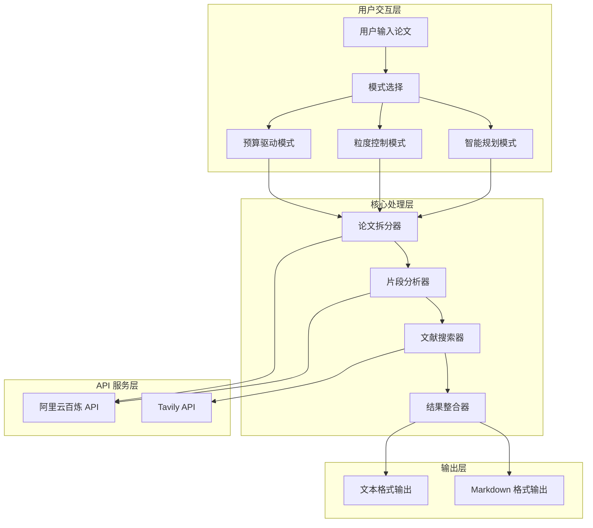
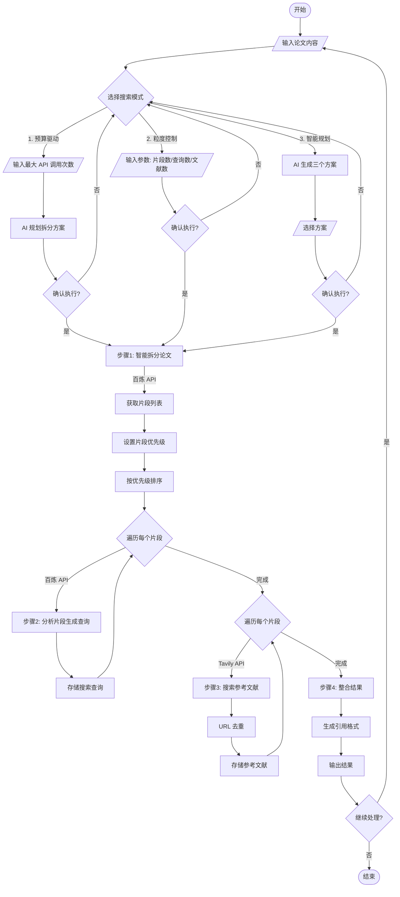
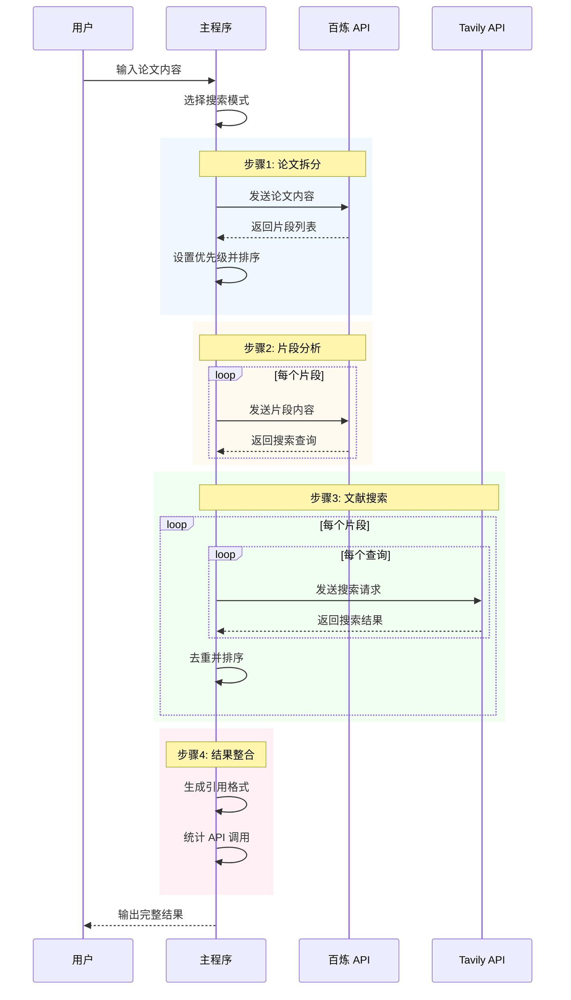
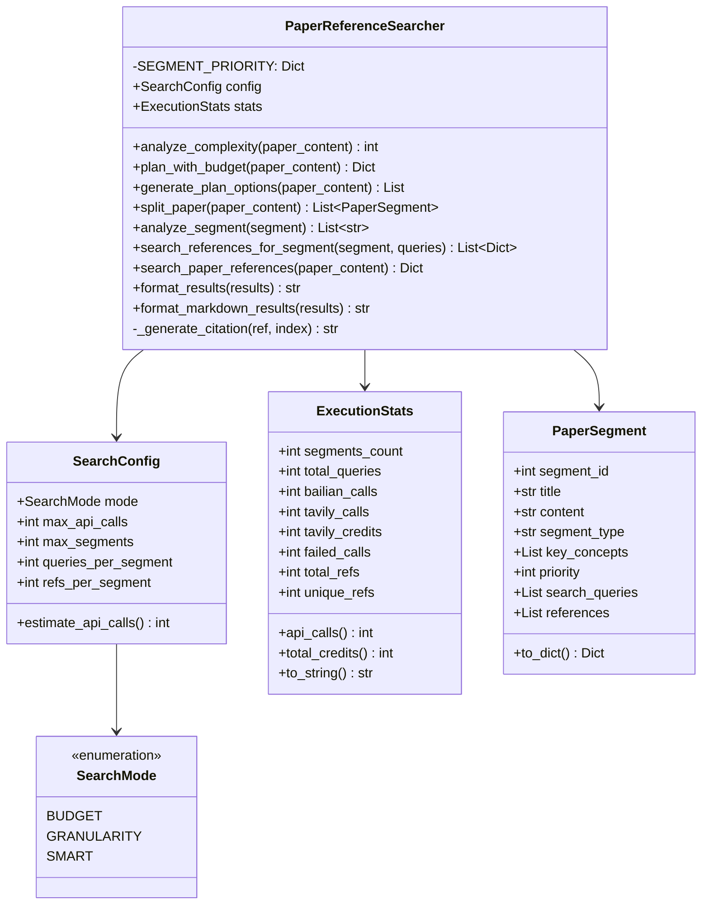
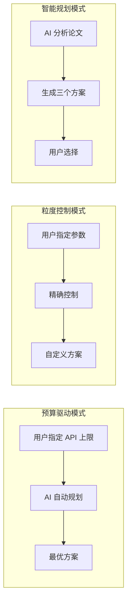
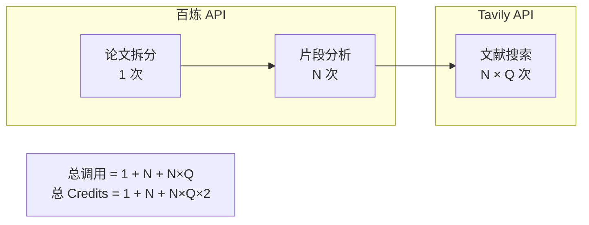
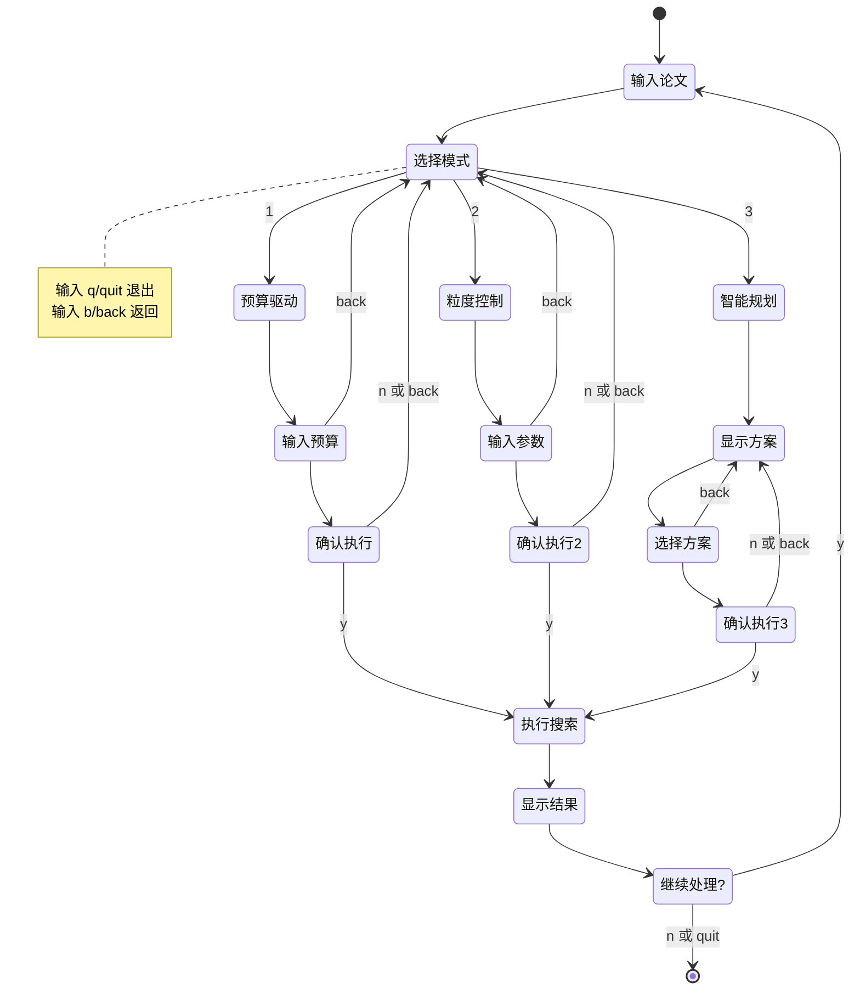
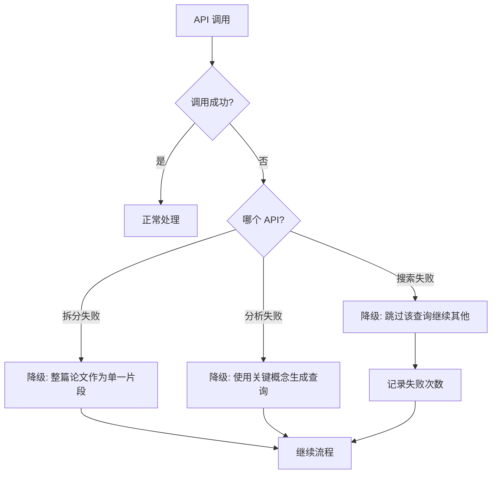

# PaperTrace 系统设计文档

## 一、系统概述

PaperTrace 是一个智能论文参考文献搜索工具，通过 AI 技术自动拆分论文内容并为每个片段搜索相关的参考文献。

### 核心能力

- **智能拆分**：使用 LLM 将论文按语义单元拆分为独立片段
- **精准搜索**：为每个片段生成针对性搜索查询，在学术网站检索
- **成本控制**：支持三种模式灵活管理 API 调用成本
- **引用生成**：自动生成符合 GB/T 7714-2015 标准的引用格式

---

## 二、系统架构

### 整体架构图



---

## 三、完整处理流程

### 主流程图



### 详细处理流程



---

## 四、核心类设计

### 类图



### 核心类说明

#### SearchConfig

统一的搜索配置类，管理搜索参数：

| 属性 | 类型 | 说明 | 默认值 |
|------|------|------|--------|
| `mode` | SearchMode | 搜索模式 | BUDGET |
| `max_api_calls` | int | 最大 API 调用次数 | 20 |
| `max_segments` | int | 最大片段数 | 5 |
| `queries_per_segment` | int | 每片段查询数 | 2 |
| `refs_per_segment` | int | 每片段文献数 | 3 |

#### ExecutionStats

执行统计信息类，记录运行数据：

| 属性 | 说明 |
|------|------|
| `bailian_calls` | 百炼 API 调用次数 |
| `tavily_calls` | Tavily API 调用次数 |
| `tavily_credits` | Tavily Credits 消耗（advanced 模式每次 2 Credits） |
| `total_credits` | 总 Credits 消耗 |

#### PaperSegment

论文片段数据结构：

| 属性 | 说明 |
|------|------|
| `segment_type` | 片段类型（background/method/experiment/discussion/conclusion/other） |
| `priority` | 优先级（method=3, experiment=2, background=1） |
| `key_concepts` | 关键概念列表 |
| `search_queries` | 生成的搜索查询 |
| `references` | 找到的参考文献列表 |

---

## 五、三种搜索模式

### 模式对比



### 预算驱动模式

用户指定 API 调用上限，AI 自动规划最优拆分方案：

```python
# 预估公式
estimated_credits = 1 + segments + segments * queries_per_segment * 2

# 其中：
# 1 = 论文拆分（百炼）
# segments = 片段分析（百炼）
# segments * queries * 2 = 文献搜索（Tavily advanced 模式）
```

### 粒度控制模式

用户手动设置所有参数：
- 最大片段数（1-20）
- 每片段查询数（1-10）
- 每片段返回文献数（1-10）

### 智能规划模式

AI 分析论文复杂度后生成三个方案：

| 方案 | 片段数 | 查询数/片段 | 预估 Credits | 适用场景 |
|------|--------|-------------|--------------|----------|
| 经济 | 3 | 2 | 16 | 初步调研 |
| 标准 | 5 | 3 | 36 | 常规使用 |
| 深度 | 8 | 4 | 73 | 深入研究 |

---

## 六、API 调用统计

### 调用流程



### Credits 计算示例

假设：segments=5, queries_per_segment=3

| API 类型 | 调用次数 | Credits |
|----------|----------|---------|
| 百炼（拆分） | 1 | 1 |
| 百炼（分析） | 5 | 5 |
| Tavily（搜索） | 15 | 30 |
| **总计** | **21** | **36** |

---

## 七、交互设计

### 用户交互流程



### 交互命令

| 命令 | 说明 |
|------|------|
| `q` / `quit` | 退出程序 |
| `b` / `back` | 返回上一步 |
| `y` / `n` | 确认/取消 |

---

## 八、输出格式

### 文本格式

```
======================================================================
论文参考文献搜索结果
======================================================================

----------------------------------------------------------------------
原始论文内容
----------------------------------------------------------------------
[完整论文内容]

----------------------------------------------------------------------
搜索结果摘要
----------------------------------------------------------------------
共拆分为 5 个片段
共找到 25 篇参考文献
去重后 18 篇
每个片段最多 3 篇参考文献
API 调用：21 次
  - 百炼 API：6 次
  - Tavily API：15 次（advanced 模式）
Credits 消耗：36
  - 百炼 API：6 Credits
  - Tavily API：30 Credits（每次 2 Credits）

----------------------------------------------------------------------
## 片段 1: 方法描述
----------------------------------------------------------------------
类型: method
关键概念: Transformer, Attention, Self-attention

片段内容:
[完整片段内容]

搜索查询:
  1. transformer attention mechanism original paper
  2. self-attention neural network

推荐参考文献 (3 篇):

  [1] Attention Is All You Need
      URL: https://arxiv.org/abs/1706.03762
      相关性: 0.95
      来源查询: transformer attention mechanism original paper
      引用格式: [1] Attention Is All You Need[EB/OL]. arXiv预印本, 2026-03-12. https://arxiv.org/abs/1706.03762
      摘要: [完整摘要]
```

### 引用格式

符合 GB/T 7714-2015 标准：

```
[序号] 标题[EB/OL]. 来源, 访问日期. URL
```

示例：
```
[1] Attention Is All You Need[EB/OL]. arXiv预印本, 2026-03-12. https://arxiv.org/abs/1706.03762
```

---

## 九、降级处理

为保证系统稳定性，设计了以下降级策略：



| 失败场景 | 降级策略 |
|----------|----------|
| 论文拆分失败 | 将整个论文作为单一片段处理 |
| 片段分析失败 | 使用片段的关键概念生成简单查询 |
| 文献搜索失败 | 跳过该查询，继续其他查询 |

---

## 十、技术选型

| 组件 | 技术方案 | 原因 |
|------|---------|------|
| 论文分析 | 阿里云百炼（通义千问） | 中文理解能力强，API 稳定，成本低 |
| 文献搜索 | Tavily API | 专为 AI Agent 设计，支持学术域名限定 |
| 环境管理 | python-dotenv | 安全管理 API Key |
| 数据结构 | dataclass | 简洁的数据类定义 |

### 学术搜索域名

| 域名 | 说明 |
|------|------|
| arxiv.org | 预印本论文库 |
| scholar.google.com | Google 学术搜索 |
| dl.acm.org | ACM 数字图书馆 |
| ieeexplore.ieee.org | IEEE Xplore |
| springer.com | Springer 出版社 |
| nature.com | Nature 期刊 |
| science.org | Science 期刊 |
| semanticscholar.org | Semantic Scholar |
| pubmed.ncbi.nlm.nih.gov | PubMed 医学文献库 |

---

## 十一、未来优化方向

1. **缓存机制**：对相似查询结果进行缓存，减少 API 调用
2. **并行处理**：多片段并行搜索，提升效率
3. **相关性优化**：结合片段语义和搜索结果进行二次排序
4. **更多引用格式**：支持 APA、MLA 等多种引用格式
5. **本地模型支持**：支持本地部署的 LLM，降低 API 依赖